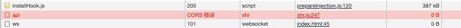

# 开篇废话两句

跨域，老生常谈的话题了，前端学习初期，相信每一个前端er都背过相关八股，其中有一条解决方案就是webpack解决跨域——开发模式下借助`webpack-dev-server`代理服务器解决跨域。

曾经很多死记硬背的知识，尤其是前端八股里一段一段文字性的描述，给我留下的印象就是特别痛苦，读了也不明所以，但随着现在一点一点的沉淀，有一种自然而然就懂了的感觉，懂了还不够，现在也具备了更强的动手能力，很多简单的小demo随手就写，这是我以前不曾做到的。

我没看过`webpack`源码，但仅凭一句话—— *借助`webpack-dev-server`代理服务器解决跨域* 我觉着就已经把`webpack-dev-server`内部做的事情概括的很清楚了，下面我要写的demo也完全是根据这句话➕个人想象力➕以解决跨域为目标随便写的，意在分享，帮助需要的人（新手）。

# 思路总结

demo的模拟思路：需要一个本地正在开发的前端项目，我们用`feApp/index.html`来模拟；一个后端服务器接口项目，用`apiServer/index.js`来模拟，预计我们的前端项目请求后端接口因为跨域问题请求失败，然后通过`mini-webpack-dev-server/index`服务器项目来解决这个问题。

~~~
cross-origin-demo/
├── feApp/
│   └── index.html
├── apiServer/
│   └── index.js
└── mini-webpack-dev-server/
    └── index.js
~~~

# 跨域问题复现

`apiServer/index.js`:

~~~js
// 执行node index.js后http://127.0.0.1:80/api即为接口地址
const express = require('express'); 

const app = express();

app.get('/api', (req, res) => {
    res.send("服务端响应的数据");
})

app.listen(80, () => {
    console.log('http://127.0.0.1');
})
~~~

`feApp/index.html`：

~~~html
<!DOCTYPE html>
<html lang="en">
<head>
    <meta charset="UTF-8">
    <meta http-equiv="X-UA-Compatible" content="IE=edge">
    <meta name="viewport" content="width=device-width, initial-scale=1.0">
    <title>Document</title>
</head>
<body>
    
    
</body>
</html>
~~~

通过`live Server`插件运行这个`html`后浏览器地址栏为`http://127.0.0.1:5500/feApp/index.html`，端口不一样，肯定是跨域的，然后请求抓包的结果为：

# 通过代理服务器解决跨域

`mini-webpack-dev-server/index.js`:

~~~js
const { resolve } = require("path");
const axios = require("axios");

const express = require('express');

const app = express();

// 利用express.static中间件托管静态资源，下面的操作就相当于把/feApp文件夹下的资源都挂载到了这个node服务的端口下，也就是说如果启动这个node服务，通过http:127.0.0.1:81/index.html是可以访问到我们的“前端项目”的
app.use(express.static(resolve(__dirname,"../feApp")));

// 我们这里这个接口做的事情是请求http://127.0.0.1:80/api，也就是我们的apiServer文件夹下的那个模拟的后端服务，获取数据后返回给
// 类似于做了一个请求转发
app.get('/api', async (req, res) => {
    let ans = await axios.get("http://127.0.0.1:80/api");
    res.send(ans.data);
})

app.listen(81, () => {
    console.log('http://127.0.0.1');
})
~~~

同时，我们也修改一下`feApp/index.html`中请求的目标地址为`http://127.0.0.1:81/api`

## 关系分析：

我们执行`node mini-webpack-dev-server/index.js`把代理服务跑起来，这一步也是对`webpack-dev-server`启动前端项目的一个模拟，所以就不用通过`live-server`插件专门开个本地服务器去启动前端项目`feApp/index.html`了，直接通过`127.0.0.1:81/index.html`访问即可，同时也启动`apiServer/index.js`服务，作为后端服务器随时准备接收请求。

这里明确前端项目`feApp/index.html`、服务端接口项目`apiServer/index.js`、代理服务器项目`mini-webpack-dev-server`三者的关系，首先，前端项目当前是被代理服务器项目所托管的，换句话说，前端项目与服务端代理项目同源，都在`http://127.0.0.1:81`上，不存在跨域问题，然后代理服务器项目与服务端接口项目是属于node服务与node服务之间的关系，压根不涉及浏览器，自然也没有所谓的跨域。

浏览器访问`http://127.0.0.1:81/index.html`，控制台成功打印出了响应数据：`{data: '服务端响应的数据', status: 200, statusText: 'OK', headers: i, config: {…}, …}`。

## 请求流程梳理：

前端项目`index.html`中请求的是与自己同源的代理服务器项目的接口，代理服务器接口被请求后的处理逻辑是请求服务端项目，代理服务器收到服务端项目的响应之后再响应前端项目，最终前端项目拿到数据。

[demo源码](https://github.com/jinrd123/cross-origin-demo)